# PWA

## Secret key

The `secret key` is the root of trust of a user. It is used to encrypt file keys, album keys, and some request parameters. It can also be used to recover the user's account and force a new password. It is very important to protect it.

Within the PWA, the `secret key` is saved in the encrypted store, which is protected by the `store key`. When the app is _locked_, the `store key` is not present into the PWA anywhere. When the app is _unlocked_, the `lock passphrase` is used to derive the `store key`. Both the frontend and the service worker keep a reference to the `store key` as long as the app is _unlocked_. There is no API to retrieve the `store key` from the frontend or the service worker, but forensics tools could get it. Knowledge of the `lock passphrase` or the `store key`, combined with the `salt` used to derive the `store key` are sufficient to discover the user's `secret key`.

The user's `password` can also be used to retrieve the `secret key` from the `key bundle` that's stored on the server. The `key bundle` (usually) contains an _encrypted_ version of the `secret key`, and the user's `password` can be used to decrypt it. So, knowledge of the user's `password` is sufficient to discover the user's `secret key`.

The user's `backup phrase` is effectively the same thing about the user's `secret key`, presented in a human-readable format.

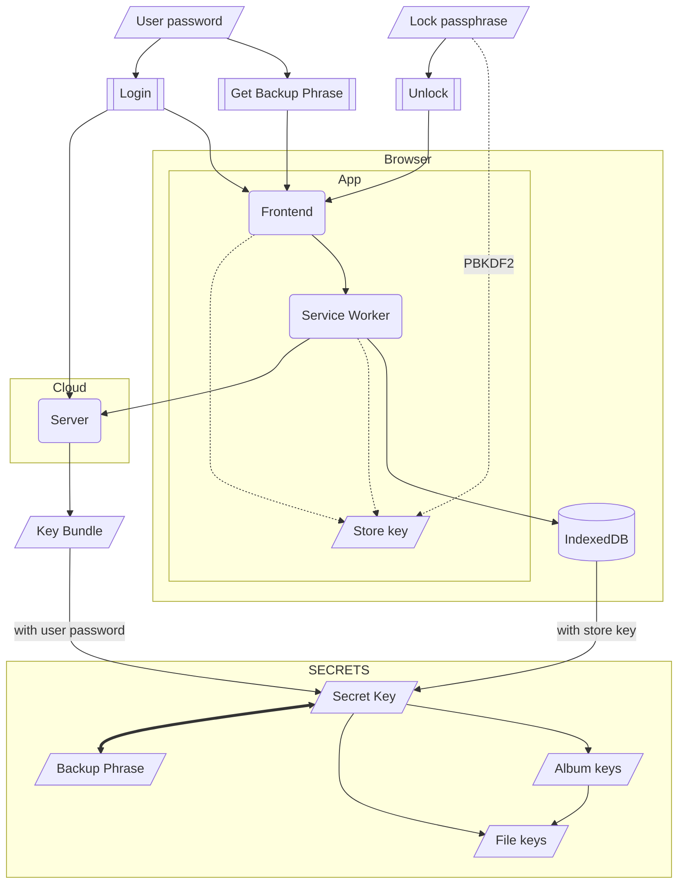

## Encrypted store sequence diagrams

The PWA's service worker uses an an encrypted object store in IndexedDB. The object keys are plaintext, but the values are encrypted with `crypto_secretbox` using a 256-bit key derived from a passphrase provided by the user, or a random key if the user chooses the _skip passphrase_ option.

Under normal operations, both the frontend and the service worker keep a copy of the hashed passphrase. This is required because:
1. The service worker is started and stopped by the browser as needed. When it starts it gets the hashed passphrase from the frontend.
2. The frontend also reloads when switching between apps, or when the user triggers a page reload. When that happens, the frontend attempt to fetch the hashed passphrase from the service worker, before prompting the user.

When neither the frontend nor the service worker is running, or when the store was manually locked, the user has to enter the passphrase.

This section describes the sequence of events for setting a passphrase, locking, unlocking, etc.

Note that the server is not involved at all.

### Set passphrase / unlock

Sequence diagram of setting a passphrase or unlocking the store. This sequence also happens when the frontend is reloaded while the service worker is not running.

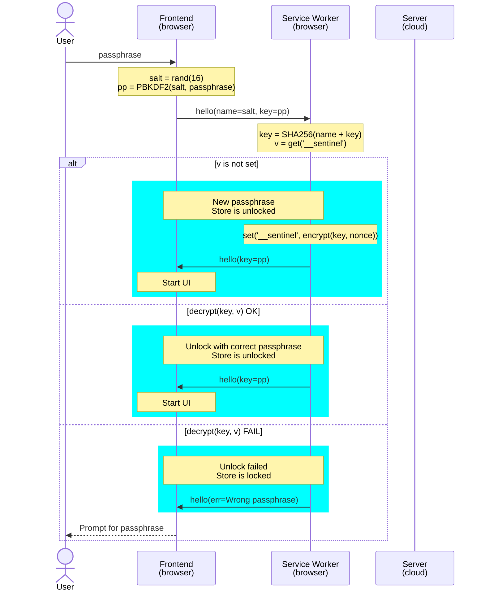

### Reload frontend

Sequence diagram of reloading the frontend while the service worker is running.

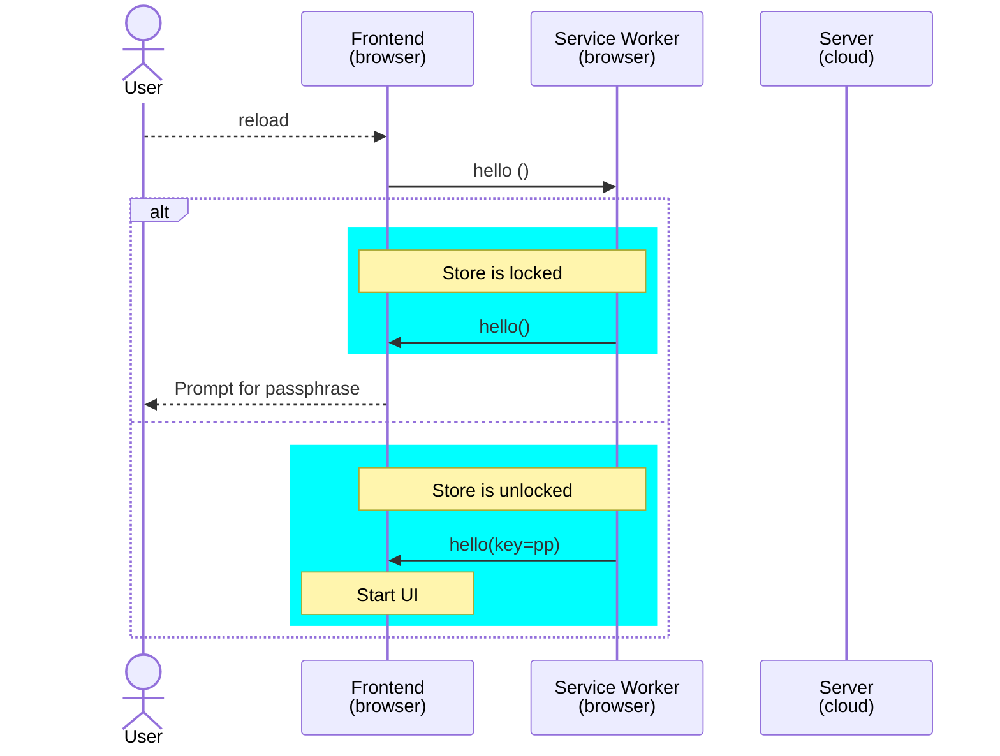

### Restart service worker

Sequence diagram of restart the service worker while the frontend is running.

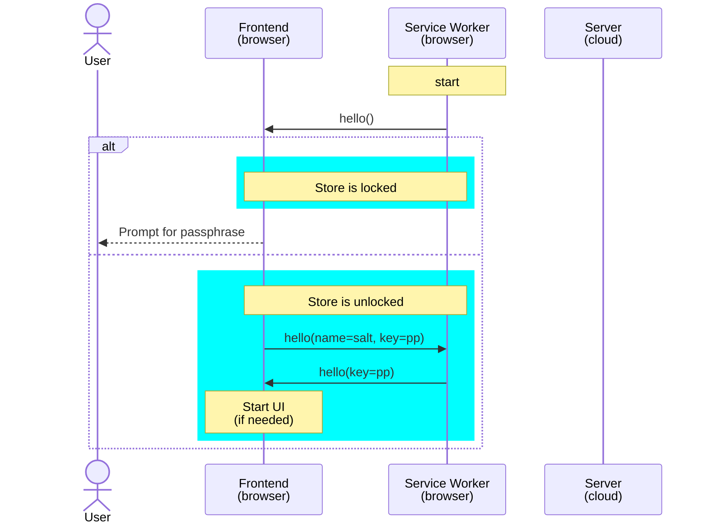

### Lock

Sequence diagram for locking the store.

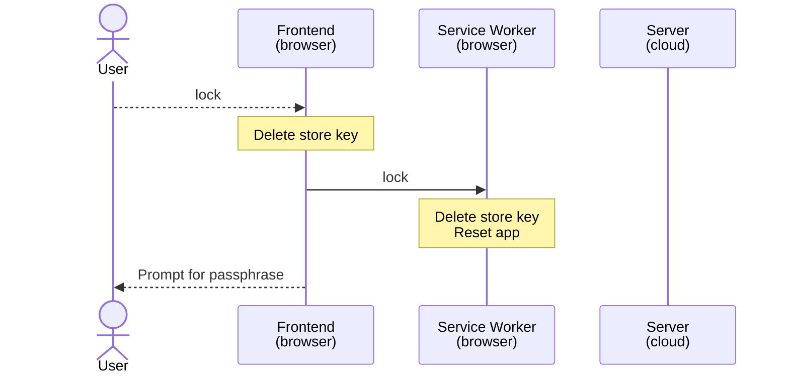

## Account lifecycle

When a user creates an account, they provide their `email`, a `salt`, a `hashed password`, and a `key bundle`. The `key bundle` contains the user's public key, and usually the user's encrypted secret key.

When the user logs in, they provide their `email`, and their `hashed password`. After the credentials are validated, the server returns a `token` and the user's `key bundle`. The `token` is evidence that the user is logged in and must be included in most requests.

If the user forgets their password, they can use their `backup phrase` to recover their account. The `backup phrase` is a `bip39` mnemonic of the secret key itself, i.e. it is functionally equivalent to the secret key.

### Create account

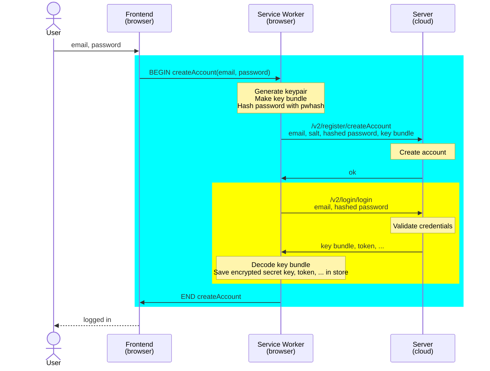

### Login

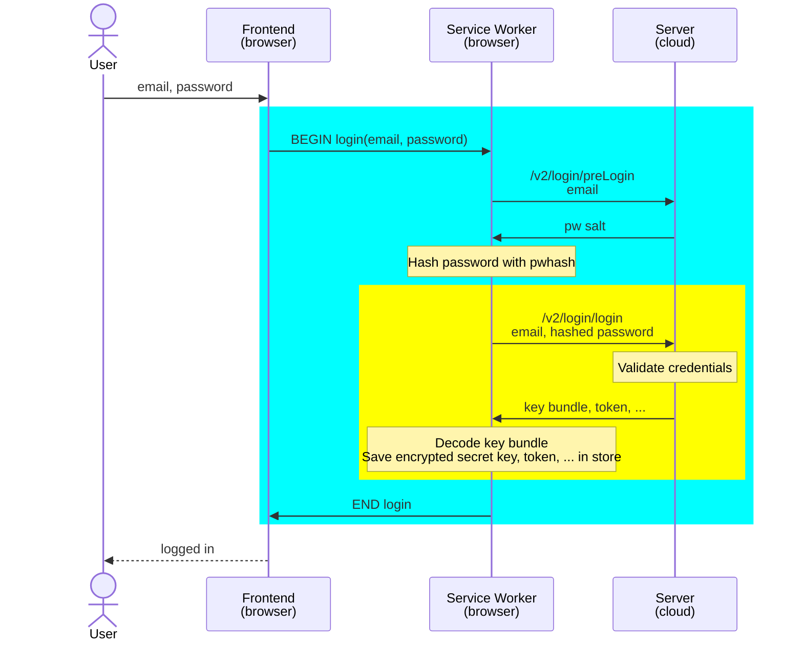

### Recover account

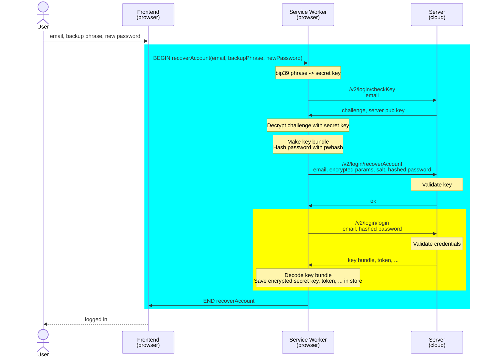

### Delete account

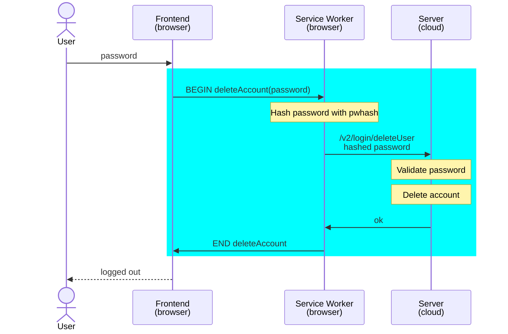

## Media

Media files are encrypted with a symmetric key. Each file has its own key, which is itself kept encrypted using the either the user's `secret key` or the `album secret key`.

When media files are download, the encrypted blob is retrieved from the server and decrypted by the service worker. Similarly, when a file is uploaded, it is encrypted by the service worker, and then the encrypted blob is uploaded to the server.

### Read / download media

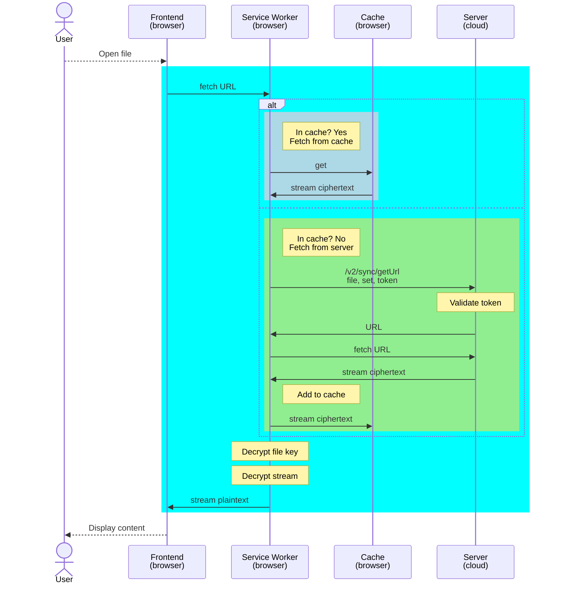

### Upload media

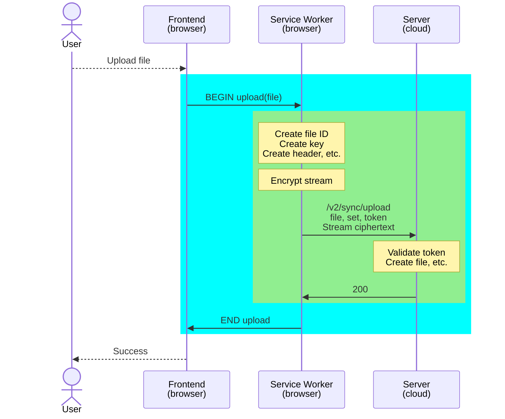
